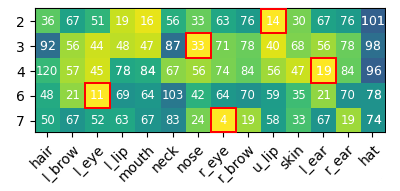
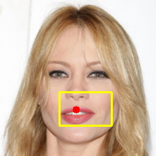

# ProtoPNet: Are Learned Concepts Understandable?
A study on the interpretability of the concepts learned by [Prototypical Part Networks](https://arxiv.org/abs/1806.10574) (ProtoPNets). 

This work exploits the part locations annotations available for two different datasets to provide an objective evalution of the prototypes. An additional *diversity regularization* is also introduced to produce more diverse concepts. 

More details on the implementation can be found in the [report](report.pdf).

<table>
    <tr align="center">
        <td valign="top">
            <div><i>California Gull</i> class<div>
            
            <br/>
            
            
            
            
            
            <br/>
                             <sup>580</sup>
            <sup>583</sup>
            <sup>585</sup>
            <sup>587</sup>
            <sup>588</sup>
        </td>
        <td valign="top">
            <div><i>Female</i> class<div>
            
            <br/>
            
            
            
            
            
            <br/>
                             <sup>2</sup>
            <sup>3</sup>
            <sup>4</sup>
            <sup>6</sup>
            <sup>7</sup>
        </td>
    </tr>
</table>


## Get started
- Clone the repository and install the required dependencies:
    ```shell
    git clone https://github.com/materight/explainable-ProtoPNet.git
    cd explainable-ProtoPNet
    pip install -r requirements.txt
    ```
- Download and prepare the data, either for the [Caltech-UCSD Birds-200](http://www.vision.caltech.edu/datasets/cub_200_2011/) or the [CelebAMask HQ](http://mmlab.ie.cuhk.edu.hk/projects/CelebA/CelebAMask_HQ.html) datasets:
    ```shell
    python prepare_data.py cub200
    python prepare_data.py celeb_a
    ```

## Train a model
To train a new model on a dataset, run:
```shell
python train.py --dataset [data_path] --exp_name [experiment_name]
```
Additional options can be specified (run the script with `--help` to see the available ones).

After training, the learned prototypes can be further pruned:
```shell
python prune_prototypes.py --dataset [data_path] --model [model_path]
```

## Evaluate learned prototypes
To evaluate a trained model and the learned prototypes, run:
```shell
python evaluate.py --model [model_path] {global|local|alignment} --dataset [data_path] 
```
- `global`: retrieve for each prototype the most activated patches in the whole dataset.
- `local`: evaluate the model on a subset of samples and generate visualizations for the activated prototypes for each class.
- `alignment`: generate plots for the alignment matrix of each class.

## Acknowledgments
This implementation is based on the original [ProtoPNet](https://github.com/cfchen-duke/ProtoPNet) repository.
